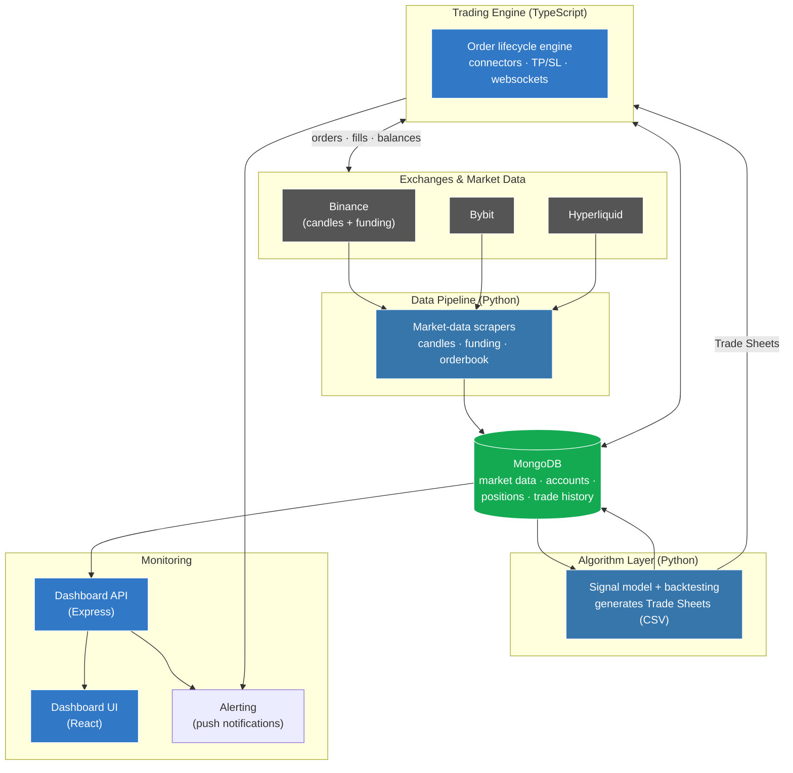

# CryptoBot — Algorithmic Crypto Trading System

A reference overview of a production, machine-learning-driven crypto trading platform —
documented through architecture diagrams, design write-ups, and feature breakdowns.

---

## Disclaimer

This is a **public reference / portfolio** repository. The actual trading system is private.
To protect both the strategy and any funds, this repository deliberately:

- contains **no source code** of the strategy or execution engine,
- contains **no API keys, private keys, wallet addresses, tokens, cookies or endpoints**,
- shows only **architecture, design and feature-level** information.

The content was written by hand from architectural knowledge — no files were copied from the
private codebase — and scanned for secrets before publishing. See [`SECURITY.md`](SECURITY.md)
for the full policy.

---

## Component deep-dives

| Component | What it does | Details |
|---|---|---|
| **Algorithm layer** | Research, signal modelling & backtesting that produce Trade Sheets | [`docs/algorithm.md`](docs/algorithm.md) |
| **Data pipeline & infra** | Market-data scrapers, storage, deployment | [`docs/data-pipeline.md`](docs/data-pipeline.md) |
| **Dashboard (React + API)** | Real-time monitoring & control surface | [`docs/dashboard.md`](docs/dashboard.md) |
| **Architecture & data model** | How the layers fit together | [`docs/architecture.md`](docs/architecture.md) |

---

## At a glance

CryptoBot is a **fully automated, multi-exchange algorithmic trading platform** for crypto
perpetual futures, built around a **machine-learning price-prediction system**. It runs
unattended on a server, turns model-generated signals into live orders across exchanges,
tracks every position in a database, and exposes a real-time dashboard for monitoring
performance. It has been **live trading Ethereum on Hyperliquid since October 2025.**

| | |
|---|---|
| **Domain** | Algorithmic trading · quantitative finance · applied ML |
| **Style** | Systematic, model-driven perpetual-futures trading |
| **Live since** | October 2025 — Ethereum on Hyperliquid |
| **Exchanges** | Hyperliquid (primary), Bybit, Bitvavo |
| **Backtested markets** | BTC, ETH, SOL, AVAX, ADA, LINK, DOT, LTC … (USDC-quoted perps) |
| **Run mode** | 24/7 unattended on a Linux VPS, managed by PM2 |
| **Scale** | Multi-account / multi-profile — many bots from one engine |

**Spans the full stack of an ML trading operation:** research & strategy modelling
(rule-based filters + a random-forest classifier with weekly walk-forward validation), data
engineering, a trade-execution engine, exchange integrations, infrastructure, and a full
monitoring dashboard.

---

## What problem does it solve?

Manual crypto trading doesn't scale: it can't watch the market 24/7, it's emotional, and it
can't consistently apply a tested strategy. CryptoBot closes that gap with a clean
separation between **deciding** and **doing**:

1. **Research & signal generation (Python)** — historical market data is collected,
   features are engineered, and a model produces a forward-looking *trade sheet*: which
   asset to trade, in which direction, at what size, with which take-profit and stop-loss.
2. **Execution (TypeScript)** — a robust engine reads those trade sheets and manages the
   full order lifecycle on the exchange: placing orders, attaching TP/SL, reacting to
   fills over websockets, and reconciling state.
3. **Monitoring (React + API)** — a dashboard shows live positions, realized/unrealized
   P&L, and per-account performance at a glance, with alerting when something needs
   attention.

---

## System architecture

> **Clean separation of concerns:** Python owns *research & signals*, TypeScript owns
> *execution & reliability*, MongoDB is the single source of truth, and the dashboard is a
> read-mostly view on top. Each layer can evolve independently.

---

## Key features

### Trading & execution
- **Multi-exchange via a common connector interface** — Hyperliquid, Bybit and Bitvavo all
  sit behind one abstraction (`setLeverage`, `makeTpSlOrder`, `closePosition`,
  `getWalletBalanceAndEquity`, websocket order subscriptions …), so the engine is
  exchange-agnostic.
- **Full order lifecycle management** — entries, take-profit & stop-loss orders, overdue-order
  cleanup, and reconciliation of missed/partial fills.
- **Live reaction over websockets** — order-change subscriptions keep database state in sync
  with the exchange in real time, and dynamically adjust stop-losses.
- **Multi-account / multi-profile** — one engine drives many independent bot accounts, each
  with its own keys, trade sheet and settings.
- **Dry-run mode** — every action can be simulated without touching the live exchange.

### Data & research
- **Automated market-data scrapers** — historical 1-minute candles and funding rates
  (Binance), plus Bybit and Hyperliquid history/orderbook collection into MongoDB.
- **Backtesting & calibration** — strategies are validated over years of historical data
  across many assets before going live (see results below).

### Operations & monitoring
- **Real-time dashboard** — live positions, realized & unrealized P&L, per-account equity
  curves, and configurable settings.
- **Push-notification alerting** — operational errors raise urgent push notifications so
  issues are caught immediately.
- **Process management & deployment** — runs as managed PM2 processes on a Linux VPS behind
  nginx.

---

## Results & engineering highlights

The strategy is validated through extensive backtesting and calibration runs across multiple
assets (ETH, SOL, BTC, AVAX, ADA, LINK, DOT, LTC) and market regimes (bull / bear /
ranging). Each candidate configuration is scored on risk-adjusted metrics — **Sharpe ratio,
rate-of-return, and drawdown** — and only validated configurations are promoted to live
trading. Selected, measurable outcomes from building and hardening the system:

| Result | Detail |
|---|---|
| **Live in production since Oct 2025** | Trading Ethereum on Hyperliquid with real capital, unattended. |
| **Closed the sim-to-live gap 4x** | Reduced simulation-to-live profit inaccuracy from **0.216% to 0.052%** by modelling trade-entry delay and reverse-engineering Hyperliquid's execution behaviour. |
| **Cut classifier overfit ~7x** | Diagnosed that a grid-search rule filter was masking feature-level gains; redesigned the test methodology without grid-search, dropping overfit from **12.7% to 1.8%** and lifting accuracy from **62% to 73.5%**. |
| **Robust across regimes** | Redesigned strategy maintains performance across a **2-year** walk-forward, after an earlier version degraded in live trading. |
| **Stakeholder communication** | Delivered weekly written reports and presentations on performance & methodology to a non-technical advisory board. |

Example Result of Backtest:

> *Backtest equity curves and performance tables can be added here as screenshots.*

---

## Tech stack

| Layer | Technologies |
|---|---|
| **Execution engine** | TypeScript · Node.js · WebSockets · ethers.js (Hyperliquid signing) · Joi |
| **Algorithm & data** | Python · pandas · NumPy · scikit-learn / joblib · MongoDB driver |
| **Data store** | MongoDB (market data, accounts, positions, trade history) |
| **Dashboard** | React · TypeScript · Express · REST API |
| **Infrastructure** | Linux VPS · PM2 · nginx · push-notification alerting |
| **Tooling** | Jest · ts-jest · ESLint / Prettier |

---

Architecture diagrams are written in <a href="https://mermaid.js.org/">Mermaid</a> and
render automatically on GitHub.
