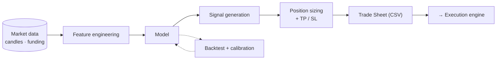

# 🧠 Algorithm Layer

> **✍️ Author-maintained section.**
> This page is intentionally left as a scaffold for **Thomas** to fill in with as much (or as
> little) strategy detail as he's comfortable making public. The headings below are a
> suggested structure — keep, edit or delete them freely.

[← Back to README](../README.md)

---

## Overview

<!-- TODO: 2–3 sentences on what the algorithm does at a high level and what edge it targets. -->

_What the model decides, and the intuition behind it._

---

## Pipeline

<!-- TODO: describe / adjust the stages. Diagram below is a starting point. -->

---

## Features & signals

<!-- TODO: which inputs/features feed the model? (price action, funding, volatility, regime…) -->

---

## Model

<!-- TODO: model family, why it was chosen, how it's trained, how often it's retrained. -->

---

## Risk management

<!-- TODO: position sizing, leverage, take-profit / stop-loss logic, exposure limits. -->

---

## Backtesting & calibration

<!-- TODO: how strategies are validated. Metrics used: Sharpe, rate-of-return, drawdown.
     Mention the multi-asset / multi-regime calibration process and how a config is
     promoted to live trading. Add equity-curve screenshots if desired. -->

---

## Results

<!-- TODO: drop in backtest equity curves, performance tables, or summary metrics. -->

[← Back to README](../README.md)
