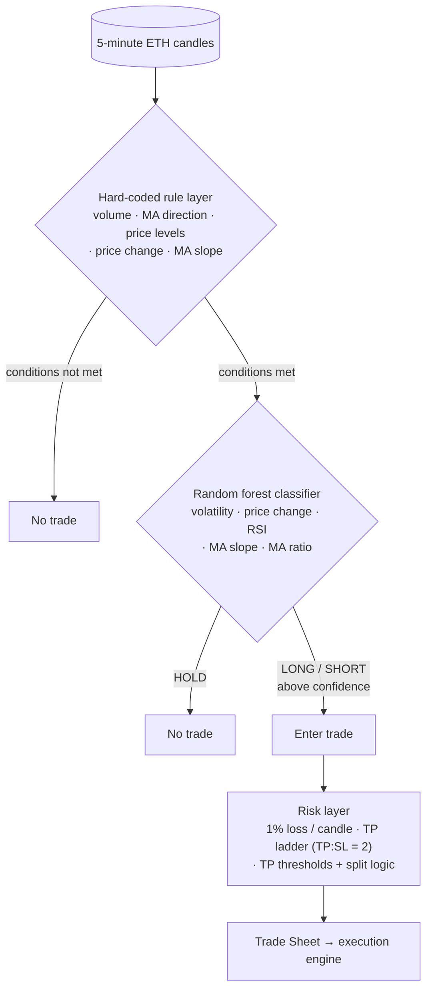

# Algorithm Layer

The goal of the algorithm is to find market patterns and automatically bet on them when they
re-occur. The pattern that triggers a trade should lead to a price movement large enough to
make a profit on. The sections below explain the algorithm itself, the simulation system used
to test it, and the calibration script that promotes settings to live trading.

[Back to README](../README.md)

---

## 1. Algorithm

### 1.1 Principles

The main design philosophy of the algorithm is *slow and steady*: a system that has been
tested across varying market conditions and remains profitable is preferred over one that is
heavily optimized for a specific period. That said, current market conditions and the most
recent results carry significant weight — they are the strongest indicators of near-future
performance.

**Target metrics:**

1. 5% – 10% net rate of return per month
2. A maximum total drawdown of 20% relative to the largest equity recorded

**Other characteristics of the algorithm:**

| Parameter | Value |
|---|---|
| Candle interval | 5 minutes |
| Asset traded | Ethereum (ETH) |
| Exchange | Hyperliquid (DEX) |
| Simulation start | October 2025 |
| Take-profit range | 1% – 4% (set at the next price level) |
| Average hold time | ~5 hours per trade |
| Weekly trade frequency | ~40 trades |
| Primary strategy | Trend-following |

### 1.2 Architecture

The algorithm is built on three pillars: a **hard-coded rule layer**, a **random forest
classifier**, and a **weekly calibration system**.

#### 1.2.1 Hard-coded rule layer

A set of pre-conditions the price action must satisfy before any trading decision is
considered. These rules act as a filter on the market state.

Inputs evaluated:

- Volume
- Moving-average direction
- Price levels
- Price change
- Price slope (short moving average)

If the conditions are not met, no trade is considered.

#### 1.2.2 Random forest classifier

If the hard-coded layer approves the market state, the random forest is enabled to make a
trading decision: **HOLD**, **LONG**, or **SHORT** (depending on the chart's configured
direction).

Features used by the classifier:

- Price volatility
- Price change
- RSI
- Moving-average slope
- Moving-average ratio

Based on the confidence the classifier returns, a decision is made on whether to enter the
trade.

#### 1.2.3 Risk management

Upon entering a trade, a maximum 1% portfolio loss per candle is maintained. This 1% is based
on the largest take-profit in the series and is split according to the number of take-profits
within the trade — which is another feature of the bot: applying a **take-profit ladder** with
a take-profit-to-stop-loss ratio of 2.

The bot also enforces an upper and lower threshold on take-profit percentage for its trades,
plus a threshold that determines when to split a trade into multiple take-profits.

Finally, if the bot incurs a certain percentage loss, trading is postponed until it is
re-calibrated in the next period.

---

## 2. Simulation System

Acquiring a proper system to simulate trading behavior and test strategies is essential. The
simulation system is described below in terms of efficiency, accuracy, robustness &
validation, and compatibility.

### 2.1 Efficiency

Since 5-minute candle data over a span of two years yields a considerable number of
datapoints, optimizing the simulation system's runtime is essential. Several methods are
applied to reduce it:

1. Running parallel instances during simulation
2. Combining open and close positions in a single dataframe instead of iterating over a series
3. Saving trained classifier forest charts for future grid-searches with identical classifier
   settings
4. Skipping iterations that have already been recorded in the database

In general, the simulation runs in around 8 hours for 400 rows of setting combinations on a
budget server.

### 2.2 Accuracy

Engineering a simulation that is 100% identical to real-life trading is impossible, yet
minimizing the discrepancy in entry/exit times and price is of the essence.

It starts by investigating how the trading platform works — Hyperliquid, in this case. For
this, profit calculations, funding-fee principles, and net-position determination were all
checked.

Next are entry positions, where the error in entry price and time must be minimized. For this,
a 6-minute delay is deliberately added, using the closing price of the 1-minute candle, which
resulted in the highest accuracy. For exits, the candle wicks are used, assuming sufficient
liquidity is present to fill. Though if more capital is used during trading, orderbook data
should be added to verify the liquidity margin.

### 2.3 Robustness and validation

Overfit is one of the root causes of why an algorithm might fail. To guard against it,
robustness tests are in place to prevent overfit and ensure the algorithm produces correct
results on data variations.

- First, multiple random states are added to the classifier to make sure a specific state
  isn't simply considered lucky.
- Next, the start and end dates of the walk-forward system that verifies the testing data are
  adjusted.
- Finally, data permutations can be generated with statistical properties similar to the
  original price action, but randomly generated. These should provide diminishing returns if
  the algorithm has learned the right market patterns.

### 2.4 Compatibility

Finally, the simulation is built in a modular way to quickly assemble filters and features for
a new strategy, increasing the speed of prototyping. Moreover, a test-mode is included to log
all trading behavior, either through CSV or visualized as in the figure below.

> *Figure: simulation test-mode visualization of trade entries and exits. (Add image at
> `assets/simulation-visualization.png`.)*

---

## 3. Calibration Script

Once the simulation system has run, the set of iterations is dissected into training and
testing periods based on the settings simulated. Varying training lengths are tested to
determine the most optimal settings for the upcoming period.

A walk-forward principle is used, where the settings for each new period are based on the most
optimal training settings. Optimization metrics such as the **Sharpe ratio** are used. The
combination of metric and training length that resolves into the most desirable results is
then used for future trading. An example of such result can be viewed in figure x.

> *Figure: Performance overview of the calibration script.
> On the x-axis, each number corresponds with a different setting template with the P-values showing how many periods are applied for training.
> The y-axis displays varying optimize metrics like the Sharpe, Consistency and Martin Ratio and their respective results.*

[Back to README](../README.md)
