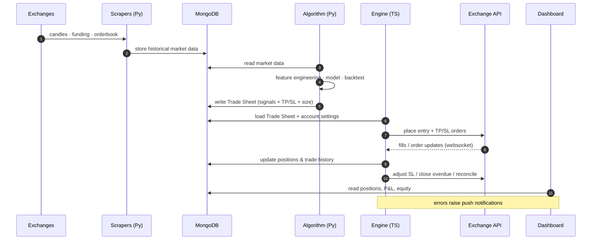
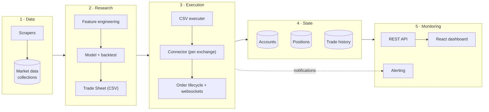
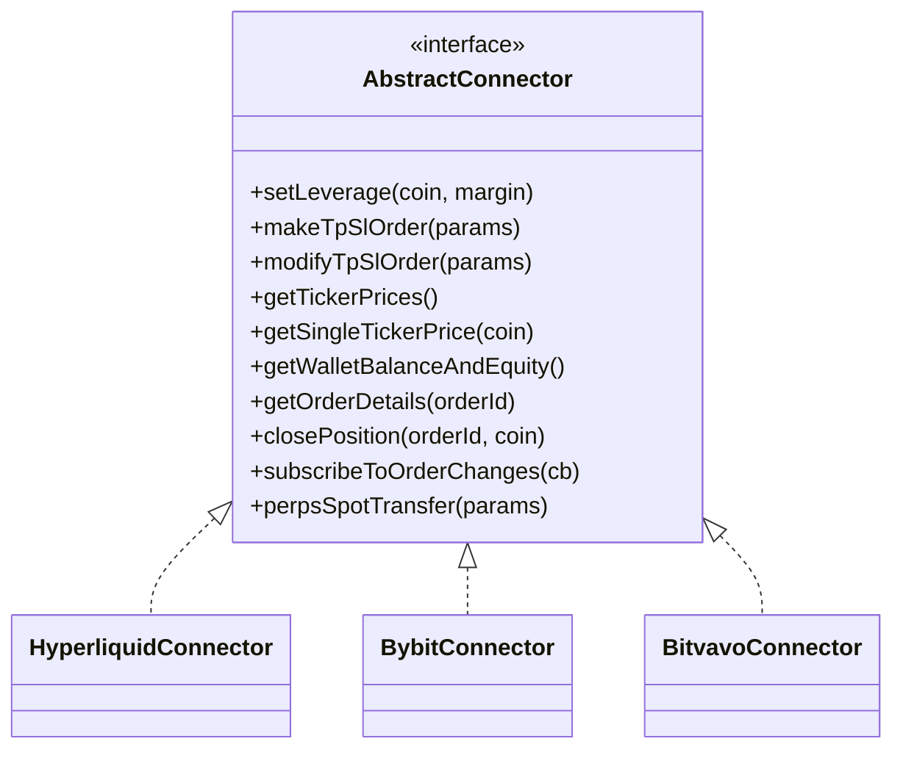
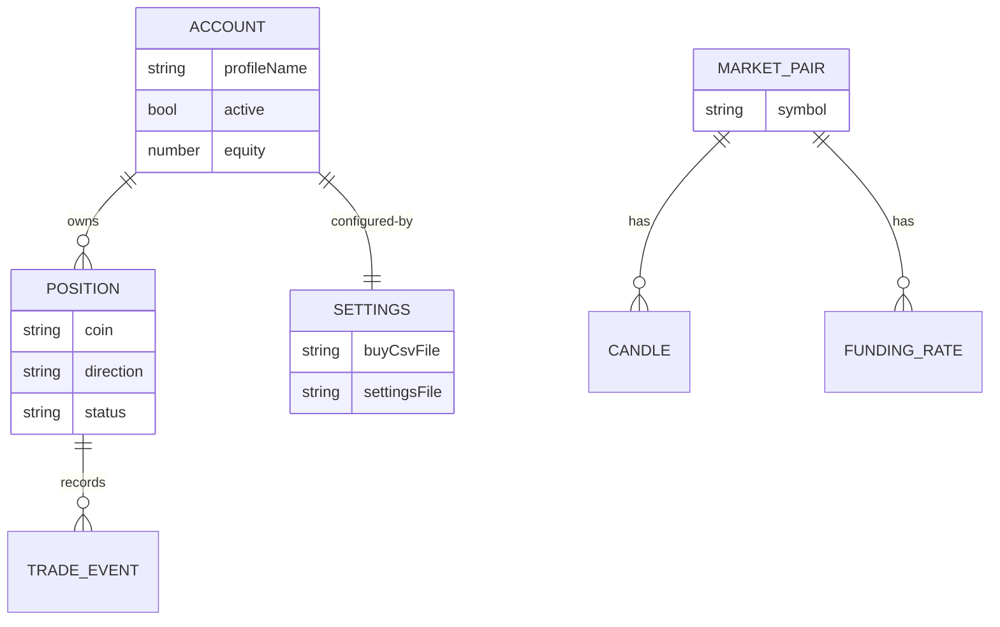
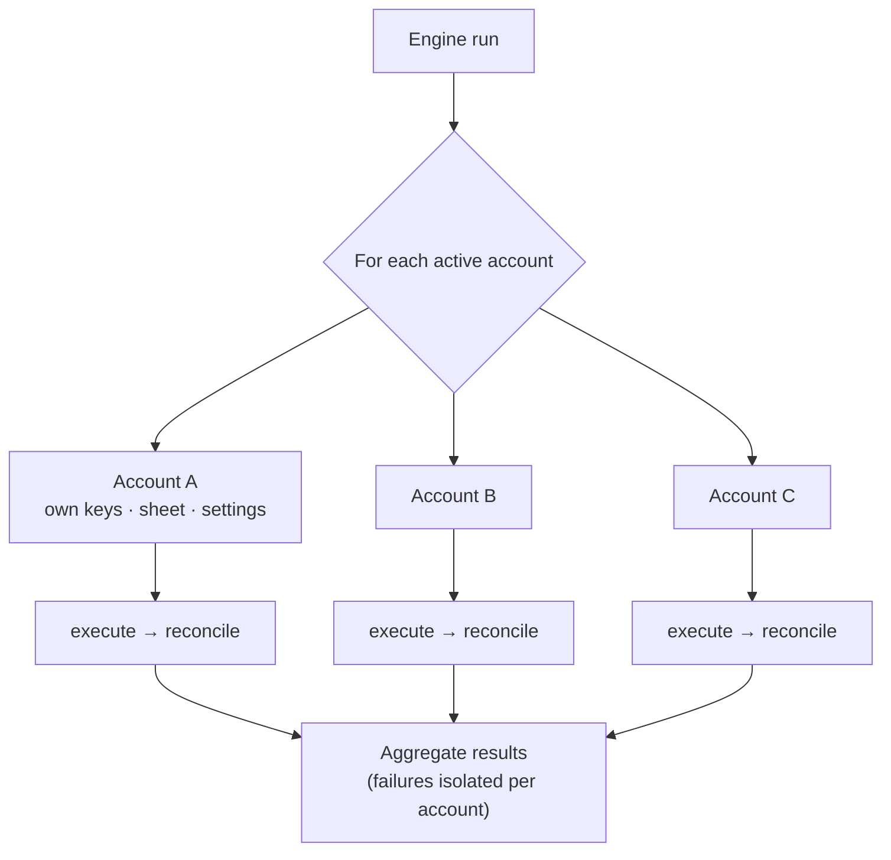

# Architecture & Data Flow

This document explains how CryptoBot's layers fit together and how a trading decision flows
from raw market data all the way to a live order and back into the dashboard.

[← Back to README](../README.md)

---

## Design principles

The system was built around a few deliberate principles:

- **Separate *deciding* from *doing*.** The Python research layer decides *what* to trade;
  the TypeScript engine decides *how* to execute it reliably. Neither leaks into the other.
- **One source of truth.** MongoDB holds market data, accounts, live positions and trade
  history. Every component reads/writes the same store, so there is no hidden state.
- **Exchange-agnostic execution.** All exchange-specific behaviour hides behind a single
  connector interface, so adding or swapping an exchange touches one module.
- **Fail loud, recover safely.** Operations that can desync (missed fills, overdue orders)
  have explicit reconciliation paths, and a dry-run mode lets every change be tested first.

---

## End-to-end trade lifecycle

---

## Layered view

---

## The connector abstraction

Every exchange is wrapped behind one **`AbstractConnector`** interface, so the engine never
talks to an exchange SDK directly. This is the key to supporting Hyperliquid, Bybit and
Bitvavo from a single execution codebase.

**Why it matters:** swapping exchanges, adding a new venue, or running the same strategy on
multiple exchanges is an *additive* change — implement the interface once and the entire
order-lifecycle engine works unchanged.

---

## Data model (conceptual)

The database is organized around **accounts** that own **positions**, with a separate body
of **market data** feeding research. (Field-level schema is intentionally omitted.)

---

## Multi-account model

A single engine invocation can drive **many independent bot accounts** in one run. Each
account has its own keys, trade sheet and settings, and accounts are processed
independently so one failing account never blocks the others.

[← Back to README](../README.md)
