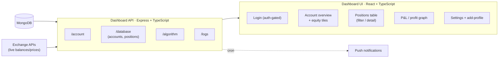
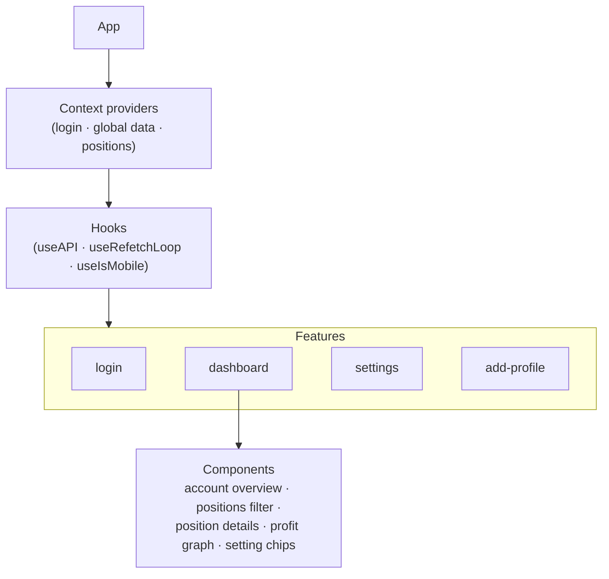

# Monitoring Dashboard (React + API)

A real-time control surface for watching every bot account in one place.

[Back to README](../README.md)

---

## Purpose

An automated trading system that you can't *see* is a liability. The dashboard turns the
database into an at-a-glance operational view: where is my money, what's open, how is each
account performing, and is anything broken?

---

## Backend API

A small **Express + TypeScript** service exposes read-mostly endpoints over the trading
database plus a few live exchange queries:

| Route | Responsibility |
|---|---|
| `/account` | Account profiles, equity & summary data |
| `/database` | Accounts and positions (e.g. positions grouped by account) |
| `/algorithm` | Algorithm/trade-sheet related data |
| `/logs` | Operational logs surfaced to the UI |

It uses standard hardening middleware (CORS, `helmet`) and runs a **cron job** that scans
for new issues and fires **push notifications** when problems appear.

---

## Frontend

A **React + TypeScript** single-page app, organized by feature:

### Highlights
- **Live refetch loop** — a polling hook keeps positions and balances fresh without manual
  refresh.
- **Multi-account overview** — every bot account is shown as a tile with its equity and
  status, so the whole fleet is visible at once.
- **Drill-down positions** — an expandable table filters and expands into per-position
  detail (entry, direction, TP/SL, P&L).
- **Profit / equity graphs** — visualize performance over time per account.
- **Auth-gated** — a login context guards the dashboard behind authentication.
- **Mobile-aware** — responsive layout via a dedicated `useIsMobile` hook.

> *Live dashboard screenshots can be dropped in here.*

[Back to README](../README.md)
