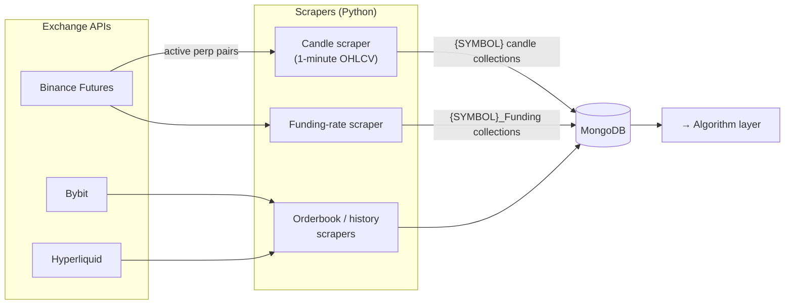
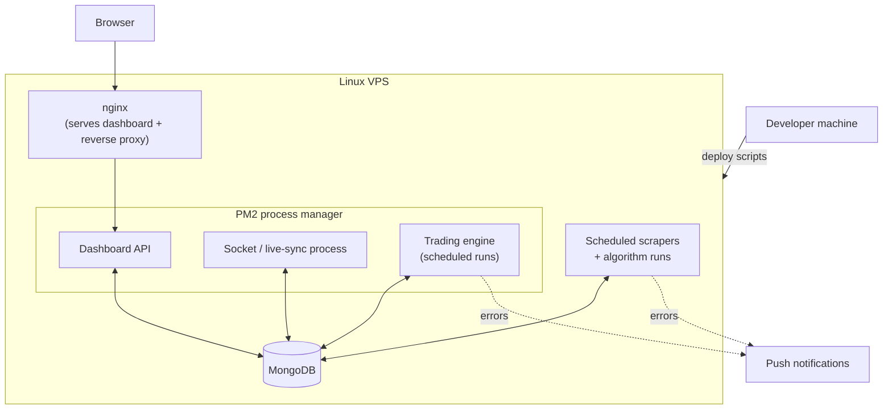

# Data Pipeline & Infrastructure

How market data is collected and stored, and how the whole system runs in production.

[Back to README](../README.md)

---

## Why a custom data pipeline?

A model is only as good as its data. Public exchange APIs are rate-limited, paginated, and
each has its own quirks. CryptoBot ships its own **scrapers** that collect clean, gap-free
historical data into MongoDB, where the research layer can query it efficiently.

### What the scrapers handle
- **Pair discovery** — fetch the currently active USDT/USDC perpetual contracts rather than
  hard-coding a symbol list.
- **Historical backfill** — page through time windows to build a deep history per symbol.
- **Incremental updates** — only fetch what's missing, so re-runs are cheap.
- **Per-symbol collections** — candles and funding rates are stored per symbol for fast,
  index-free range queries.
- **Safe test mode** — a flag lets scrapers run end-to-end *without* writing to the
  database, for validation before a live backfill.

---

## Data collected

| Data type | Source | Granularity | Used for |
|---|---|---|---|
| OHLCV candles | Binance Futures | 1-minute | Feature engineering, backtesting |
| Funding rates | Binance Futures | Per funding interval | Carry/cost modelling, signals |
| Order history | Bybit / Hyperliquid | Per fill | Reconciliation, validation |
| Orderbook snapshots | Hyperliquid | Snapshot | Microstructure research |

---

## Production deployment

The system runs unattended on a Linux VPS. Long-running processes are supervised by **PM2**
(auto-restart, logs, env injection), and the dashboard is served behind **nginx**.

### Operational characteristics
- **Scheduled execution** — scrapers, algorithm runs and trading cycles run on a schedule.
- **Process isolation** — data collection, execution, live-sync and the API are separate
  processes, so one crashing doesn't take down the rest.
- **Environment-based config** — all secrets and environment-specific paths are injected via
  environment variables / config files that live outside version control.
- **Cross-platform research** — the Python layer auto-detects whether it's running on a
  research machine or the production server and adjusts paths accordingly.
- **Alerting** — operational errors are pushed as urgent notifications for immediate
  visibility.

[Back to README](../README.md)
